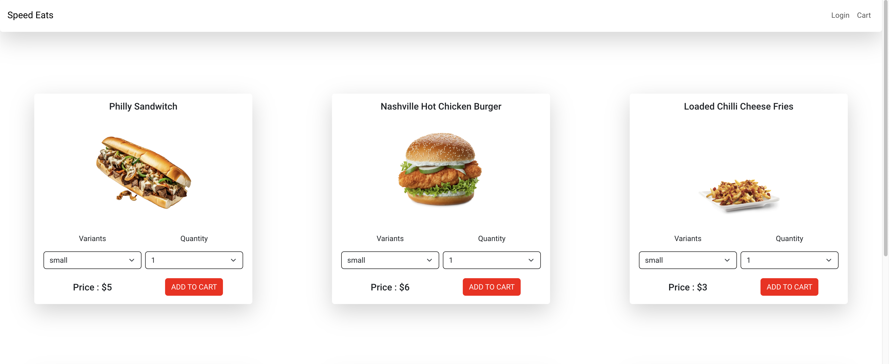

# Technologies used for this project

Redux,
Redux Thunk,
Performing Asynchronous operations with redux-thunk,
Managing State with Redux,
Cart Functionality,
Common Payment Gateway Integration,
User Authentication,
Filtering Items in Redux State,
Deploying Application to HEROKU.

# Requirements

Javascript Basics,
React Basics,
Node Basics

# App preview

